# Agent OS

[](https://github.com/kai-linux/agent-os/actions/workflows/ci.yml)
[](https://github.com/kai-linux/agent-os)
[](https://github.com/kai-linux/agent-os/fork)
[](https://github.com/kai-linux/agent-os/issues)
[](LICENSE)

**An autonomous-first software organization for supervised rollout: agents handle routine delivery loops, while humans stay in governance, review, and escalation paths.**

You give it a backlog. It ships product.

**Public proof — everything is auditable:**
[Reliability dashboard](docs/reliability/README.md) · [Case study](docs/case-study-agent-os.md) · [Live discussion](https://github.com/kai-linux/agent-os/discussions/167)

### See it work - real task, end-to-end execution

<p align="center">
  
</p>

<p align="center"><em>Real execution: Issue <a href="https://github.com/kai-linux/agent-os/issues/115">#115</a> → agent dispatched → code written → tests pass → <a href="https://github.com/kai-linux/agent-os/pull/122">PR #122</a> merged → issue closed. The happy path can complete without manual coding, but new repos should still start in supervised mode.</em></p>

### Agent Performance - rolling 14 days

| Success rate | Mean completion | Escalation rate | Tasks executed |
|:---:|:---:|:---:|:---:|
| **69%** (61/88) | **0.1h** | **11%** (10/88) | **88** |

Current pool: Claude · Codex · Gemini · DeepSeek. Metrics above are from the public reliability dashboard updated on 2026-04-21.
[Full reliability dashboard →](docs/reliability/README.md) · [Multi-agent case study →](docs/case-study-agent-os.md)

---

## Reality Check

- Agent OS is autonomous in the happy path, not "no-human-ever." Escalations are a first-class path after bounded retries.
- Results shown in this repo are for this repo's workload. A fresh external repo usually starts lower and needs tuning.
- Use `automation_mode: dispatcher_only` first for new repos, then graduate to full automation after reliability is stable.

## Recommended Rollout

If you are evaluating Agent OS on a real product, do not jump straight to full autonomy.

1. Run the sandbox demo and verify the local toolchain works end to end.
2. Start your repo in `dispatcher_only` mode with manual PR review.
3. Give it 5 to 10 bounded issues with clear success criteria and good tests.
4. Measure operator time, escalation rate, and merged-PR quality before expanding scope.
5. Turn on the planner, groomer, and full cron loop only after the supervised pilot is stable.

The best adoption story is not "trust us blindly." It is "run a cheap, auditable pilot and promote the system only after it earns trust."

## Good Initial Fits

- backend endpoints, CLI commands, docs, tests, CI fixes, and contained refactors behind existing tests
- repositories with one clear default branch, deterministic test commands, and explicit ownership
- teams that want issue-to-PR automation first, not autonomous product strategy on day one

## Poor First Fits

- sweeping UX redesigns, weakly specified frontend work, or broad "make this better" tickets
- repos with flaky CI, missing tests, hidden credentials, or ambiguous local setup
- products expecting unattended operation before the first supervised pilot has passed

---

## Goal

Make Agent OS the most credible autonomous software organization for technical founders and solo builders: a system that can reliably turn backlog input into useful shipped work, improve itself from operational evidence, and earn trust through visible results. Prioritize work that increases adoption, reliability, evidence quality, and operator confidence over work that only creates attention.

> **This README was written by an agent. The CI pipeline was built by an agent. The backlog groomer that generates improvement tickets was written by an agent dispatched from a ticket that was generated by the log analyzer. It's turtles all the way down.**

---

## Why Agent OS?

Most AI tools make individual developers faster. Agent OS asks a different question: **what if developers can focus on high-leverage decisions while agents handle routine execution?**

Not because humans aren't valuable — but because most engineering work is structured, bounded, and repetitive enough that a well-orchestrated team of AI agents can handle it autonomously. The hard part was never the coding. It was the coordination: task state, routing, context preservation, failure recovery, quality gates, and institutional memory.

Agent OS solves coordination so agents can do more of the routine delivery work reliably.

**It's not a copilot. It's not a chatbot. It's an execution system you supervise.**

---

## The Loop

<pre lang="text">
            GitHub Issue (Backlog)
                    │
            Status → Ready
                    │
            ┌───────▼────────┐
            │   Dispatcher   │  LLM-formats task, routes by repo + type
            └───────┬────────┘
                    │
            ┌───────▼────────┐
            │  Queue Engine  │  Worktree → Agent → Result → Retry/Escalate
            └───────┬────────┘
                    │
              Push branch, open PR
                    │
            ┌───────▼────────┐
            │  PR Monitor    │  CI green → merge · Conflict → rebase · Fail → escalate
            └───────┬────────┘
                    │
              Issue closed, board → Done
                    │
        ┌───────────┴───────────┐
        ▼                       ▼
  Log Analyzer            Backlog Groomer
  Files fix tickets ──► back into the backlog
</pre>

**That last arrow is the point.** The system files tickets about its own failures.
Those tickets enter the backlog. The agents fix them. The fixes get merged.
Next week, the system is better. **Indefinitely.**

---

## Recursive Self-Improvement

This is the part that makes Agent OS different from a task runner.

- **Every Monday** — the log analyzer reads a week of execution metrics, synthesizes failure patterns, and files fix tickets with evidence and reasoning
- **Every Saturday** — the backlog groomer scans for stale issues, risk flags, and undocumented known issues, then generates improvement tasks
- **Every sprint** — the strategic planner evaluates business-outcome metrics, adjusts priorities, and selects the next sprint from the backlog

These generated issues are indistinguishable from human-written ones. They enter the same queue, get dispatched to the same agents, go through the same CI → merge pipeline. The system literally engineers itself.

---

## Get Started in 5 Minutes

### Option A: Sandbox demo (2 minutes)

Zero config — creates a test issue, dispatches it to Claude, and shows the full loop:

```bash
git clone https://github.com/kai-linux/agent-os && cd agent-os
gh auth login          # only prerequisite besides claude CLI
./demo.sh              # or: make demo
```

**Requirements:** `gh` (authenticated), `python3`, `claude` CLI. Works on macOS and Linux.

### Option B: Supervised pilot on your repo (5 minutes)

Run Agent OS against your own repo in the recommended adoption path: manual dispatch first, manual review first, then controlled expansion.

**Step 1 — Clone and install**

```bash
git clone https://github.com/kai-linux/agent-os && cd agent-os
python3 -m venv .venv && source .venv/bin/activate
pip install -r requirements.txt
```

**Step 2 — Authenticate GitHub**

```bash
gh auth login
gh auth refresh -s project            # needed for GitHub Projects board access
```

**Step 3 — Configure**

```bash
cp example.config.yaml config.yaml
```

Edit `config.yaml` — the minimum you need to set:

```yaml
root_dir: "~/agent-os"
worktrees_dir: "/srv/worktrees"       # any writable path for agent worktrees
allowed_repos:
  - /path/to/your/repo                # local clone of the repo agents will work on
default_allow_push: true
```

**Step 4 — Create your first task**

Open an issue on your repo with a clear title and body containing:

```markdown
## Goal
<what you want done>

## Success Criteria
- <measurable outcome>

## Constraints
- <any boundaries>
```

Then move the issue to **Ready** on your GitHub Projects board (or add a `Status: Ready` label).

For the first pilot, choose tasks that should take one agent 10 to 40 minutes and touch a narrow surface area.

**Step 5 — Dispatch and watch**

```bash
# Run the dispatcher once to pick up your Ready issue
python3 -m orchestrator.github_dispatcher

# Run the queue to execute the task
python3 -m orchestrator.queue

# Check the result
cat runtime/mailbox/*/result/.agent_result.md
```

The agent clones a worktree, writes code, runs tests, pushes a branch, and opens a PR.

**Step 6 — View results**

```bash
# See the PR the agent created
gh pr list --repo your-user/your-repo

# Review the first few PRs manually
gh pr view <PR_NUMBER> --repo your-user/your-repo

# Auto-merge only after the supervised pilot is stable
python3 -m orchestrator.pr_monitor
```

<details>
<summary>Optional: set up cron for full autonomy</summary>

```bash
# Add to crontab — see docs/configuration.md for full reference
crontab -l 2>/dev/null; echo "
* * * * * cd $HOME/agent-os && .venv/bin/python3 -m orchestrator.github_dispatcher >> runtime/logs/dispatcher.log 2>&1
* * * * * cd $HOME/agent-os && .venv/bin/python3 -m orchestrator.queue >> runtime/logs/queue.log 2>&1
*/5 * * * * cd $HOME/agent-os && .venv/bin/python3 -m orchestrator.pr_monitor >> runtime/logs/pr_monitor.log 2>&1
"
```

Once cron is running, the system dispatches, executes, reviews, and merges with bounded retries and escalation.
</details>

### Option C: Bootstrap From Scratch

If you do not already have a repo, project board, Telegram bot, or cron installed for Agent OS, run the guided bootstrap:

```bash
bin/agentos init
```

It walks through product intake, creates a GitHub repo and Project v2 board, seeds the first backlog issues, pairs Telegram, writes `config.yaml`, and installs the required cron block.

---

## Pause & Resume

One command stops or restarts the whole orchestrator — no crontab editing, no process hunting. Every cron entrypoint sources `bin/common_env.sh`, which bails out early when a kill-switch file exists.

```bash
bin/agentos off       # pause all dispatch, queue, PR-monitor, groomer, etc.
bin/agentos on        # resume
bin/agentos status    # show current state
```

When OFF, cron jobs still fire on schedule but exit immediately (exit 0, cron-silent). Interactive runs that need to bypass the switch can set `AGENT_OS_IGNORE_DISABLED=1`.

**From Telegram.** The existing bot doubles as a control tower — the same chat that receives escalations and digests accepts commands:

| Command | Effect |
|---|---|
| `/on` | remove the global kill-switch — cron resumes on next tick |
| `/off` | engage the global kill-switch — pause the orchestrator |
| `/status` | report current ON/OFF state |
| `/repos` | list configured repos with mode + cadence + per-repo state |
| `/repo on <key>` / `/repo off <key>` | pause/resume a single repo without touching config |
| `/repo mode <key> full\|dispatcher` | flip the parent project's `automation_mode` |
| `/repo cadence <key> <days>` | set sprint + groomer cadence (in days) for that repo |
| `/jobs` | list cron entrypoints and their per-job state |
| `/job on <name>` / `/job off <name>` | pause/resume a single cron job (e.g. `pr_monitor`) |
| `/help` | list commands |

A dedicated poller (`bin/run_telegram_control.sh`) runs every minute with `AGENT_OS_IGNORE_DISABLED=1` so `/on` still reaches the orchestrator while it is paused. The `telegram_control` job itself is protected — `/job off telegram_control` is rejected so you can never lock yourself out.

**State lives in flag files** under `runtime/state/`:
- `disabled` — global kill-switch
- `repo_disabled/<key>` — per-repo skip
- `job_disabled/<name>` — per-job skip

`/repo mode` and `/repo cadence` are the only commands that touch `config.yaml`; both do surgical line edits that preserve comments.

**Secret guard.** A `hooks/pre-commit` hook blocks commits to `config.yaml` or `objectives/*.yaml` (except `objectives/example.yaml`) and rejects any staged diff containing a Telegram-bot-token shape. Enable once with `git config core.hooksPath hooks`.

---

## How It Works

| Component | Role | Cadence |
|---|---|---|
| `github_dispatcher.py` | Triages backlog, assigns + formats tasks | Every minute |
| `queue.py` | Routes to best agent, retries, escalates | Per task |
| `pr_monitor.py` | CI gate, auto-merge, auto-rebase | Every 5 min |
| `log_analyzer.py` | Failure analysis → fix tickets | Weekly |
| `agent_scorer.py` | Execution + business-outcome scoring | Weekly |
| `backlog_groomer.py` | Backlog hygiene + task generation | Config-driven |
| `strategic_planner.py` | Sprint planning from evidence + objectives | Per sprint |

4 agents in the pool: **Claude, Codex, Gemini, DeepSeek** — routed by task type with automatic fallback chains.

The backlog is GitHub Issues. The sprint board is GitHub Projects. The standup is Telegram. The office is a **$5/month VPS**.

---

## Key Design Choices

- **GitHub is the entire control plane** — no second system
- **Markdown files, not message brokers** — you can `ls` the queue
- **Isolated worktrees** — agents never collide
- **One contract, many agents** — `.agent_result.md` is the only interface
- **Memory that compounds** — `CODEBASE.md` grows with every completed task

---

## Capability Ladder

| Level | What | Status |
|---|---|---|
| 1 | Reliable execution engine | Done |
| 2 | Strategic planning + retrospectives | **Current** |
| 3 | Evidence-driven planning (analytics, research, product inspection) | In progress |
| 4 | Closed-loop optimization (hypothesis → experiment → measurement) | Next |
| 5+ | Self-directed growth across repos and products | Future |

---

## Historical Case Study Snapshot

These are historical campaign snapshots from earlier runs, included for context.
Use the reliability dashboard for current health.

| Metric | Value |
|---|---|
| Issues closed | 103 |
| PRs merged | 79 |
| Commits | 338 in 29 days (~12/day) |
| Overall success rate (campaign) | 62% (90/146 tasks) |

**[Reliability dashboard →](docs/reliability/README.md)** ·
**[Case study →](docs/case-study-agent-os.md)** ·
[GitHub Discussion](https://github.com/kai-linux/agent-os/discussions/167)

---

## Documentation

| Topic | Link |
|---|---|
| **Deployment guide for solo builders** | [docs/deployment-guide.md](docs/deployment-guide.md) |
| **External repo pilot playbook** | [docs/external-repo-pilot.md](docs/external-repo-pilot.md) |

| **Fork guide — customize agent routing, dispatch, prompts** | [FORK_GUIDE.md](FORK_GUIDE.md) |

| **Local development setup (contributors + forkers)** | [docs/local-development.md](docs/local-development.md) |

| Architecture, team roles, observability, safety | [docs/architecture.md](docs/architecture.md) |
| Task execution, handoff contract, retry logic | [docs/execution.md](docs/execution.md) |
| Configuration, objectives, evidence, cron setup | [docs/configuration.md](docs/configuration.md) |
| Roadmap and capability ladder | [docs/roadmap.md](docs/roadmap.md) |
| Case study: self-managed repo | [docs/case-study-agent-os.md](docs/case-study-agent-os.md) |
| Public reliability dashboard | [docs/reliability/README.md](docs/reliability/README.md) |
| Case study discussion | [GitHub Discussions #167](https://github.com/kai-linux/agent-os/discussions/167) |

---

## Get Involved

**Try it** — clone the repo and run `./demo.sh` to see an agent ship code in minutes.

**Contribute** — check [open issues](https://github.com/kai-linux/agent-os/issues) or file one. PRs welcome.

**Questions?** — open a [discussion](https://github.com/kai-linux/agent-os/discussions) or reach out via the repo.

If Agent OS is interesting to you, **[give it a star](https://github.com/kai-linux/agent-os)**. It helps others find the project.
